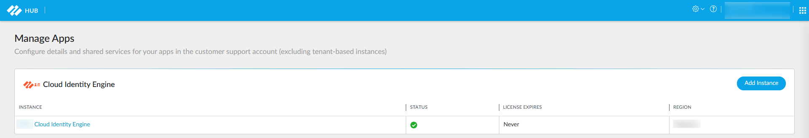
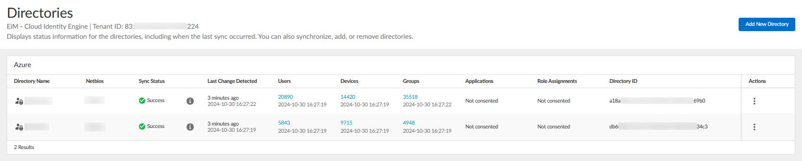
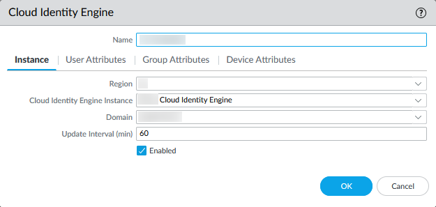
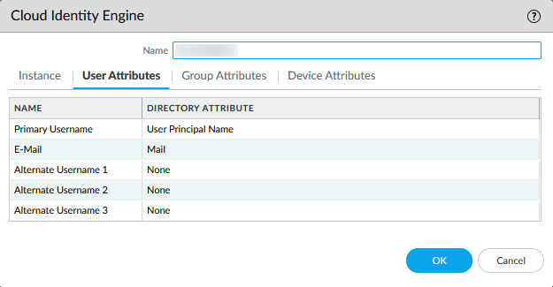
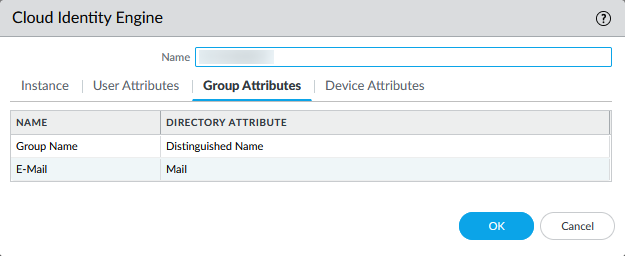
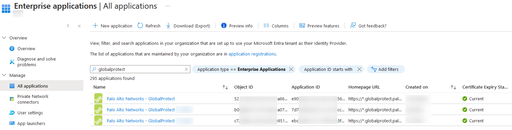

# Summary

This instruction aims to walk through the whole configuration of authentication with Azure Active Directory for Palo Alto GlobalProtect remote VPN solution.

# SAML

There are two ways to authenticate Azure users with SAML:

- [Cloud Authentication Service (CAS)](https://docs.paloaltonetworks.com/cloud-identity/cloud-identity-engine-getting-started/authenticate-users-with-the-cloud-identity-engine/configure-an-identity-provider-in-the-cloud-identity-engine/configure-azure-as-an-idp-in-the-cloud-identity-engine#id071d6534-8e31-423d-8d14-d591e2ff5edc) — **CIE** is required (Use default browser)
- [Azure SAML Integration](https://knowledgebase.paloaltonetworks.com/KCSArticleDetail?id=kA10g0000008U48CAE) — In this instruction, we use this one (Use embedded browser)

# Cloud Identity Engine

> Refer to this document to setup [**Cloud Identity Engine**](https://docs.paloaltonetworks.com/cloud-identity/cloud-identity-engine-getting-started/get-started-with-the-cloud-identity-engine/set-up-the-cloud-identity-engine)
> 

When the configuration of CIE is finished, you should be able to see the instance in [Managed Apps in Palo Alto Hub](https://apps.paloaltonetworks.com/settings)

Click the link of CIE, you will see the details about the instance and its sync status with Azure AD.

## CIE Instance

The next step is to configure the firewall and connect it to CIE through path: 

> Device / User Identification / Cloud Identity Engine

- **Region**: the region you selected on CIE

- **Cloud Identity Engine Instance**: select the instance you created on CIE

- **Domain**: select the domain you connect when deploying CIE instance

## Attributes

- **Primary Username**: UPN is the most recommended choice

- **E-mail**: Select mail-related attribute on Azure AD

  

## Group Attributes

- **Group Name**: DN would be the suitable attribute for this setting

- **E-Mail**: Use the same one as you did on previous step

  

# Security Policy

## User/Group-based Security Rule

> Group with space will **NOT** be recognized correctly!

There are few key rules need to be remembered before deep diving into the configuration when applying user or group based policy or objects.

- Use **Email Address (UPN)** as the condition to capture a single user
  - e.g. user@domain.com

- Use **Distinguished Name (DN)** as the condition to capture a single group
  - e.g. CN=group,DC=domain,DC=com

# Login Permission

## Group Creation

Login Azure AD and create new groups dedicated for GlobalProtect login through the following path.

> Azure AD / Microsoft Entra ID / New group / Assign users

## GlobalProtect Application Permission

Login Azure AD and assign the specific groups contain users require login into the application, see the path below.

> Azure AD / Enterprise applications / Palo Alto Networks - GlobalProtect (in this case) / Users and groups

