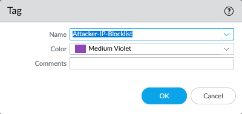
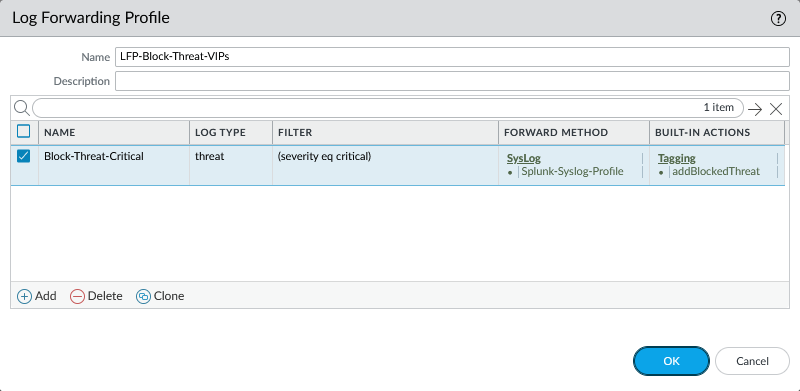
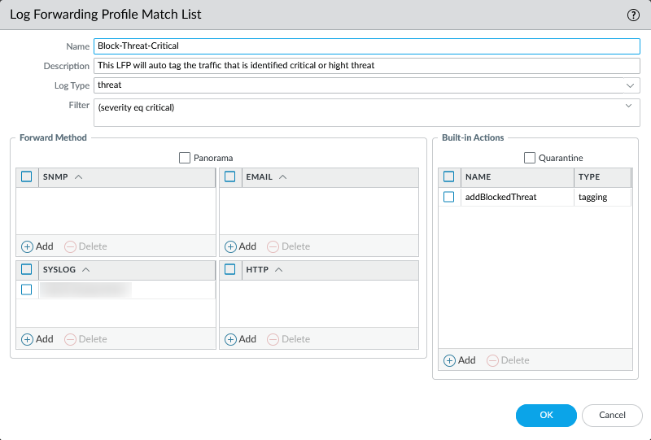
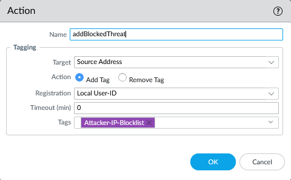
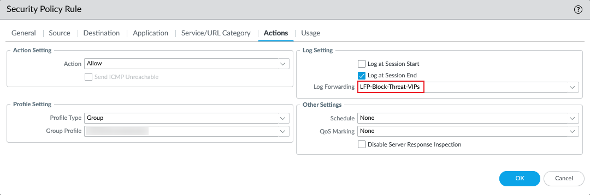
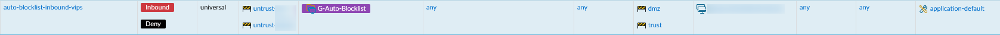

# Background

Manually blocking some repetitive network attacks is quite a headache. Tag, on Palo Alto firewall can be used to dynamically block high threat IP addresses. Let's take a look how to achieve that.

# Tagging

## 1. New Tag

> OBJECTS / Tags

First, we need to create a tag dedicated for auto-blocking.

## 2. Auto-tagging

> OBJECTS / Log Forwarding

Then, a log forwarding profile is needed to automatically tag source IP addresses identified as a threat by Palo Alto firewall.

Within the profile, we create filter that only critical threat traffic identified by the firewall will be tagged.

In action section, we attach the tag created in previous step to the source IP address of the threat traffic.

# Security Policy

> POLICIES / Security

There are two key factors that ensure the strategy works effectively. First, we need to tag the traffic; second, we need to block it. We attach the log forwarding profile to security policies related to `untrusted` incoming traffic, such as those governing publicly exposed port mappings.

Then, we create another security policy to block the traffic coming from these IP addresses.

